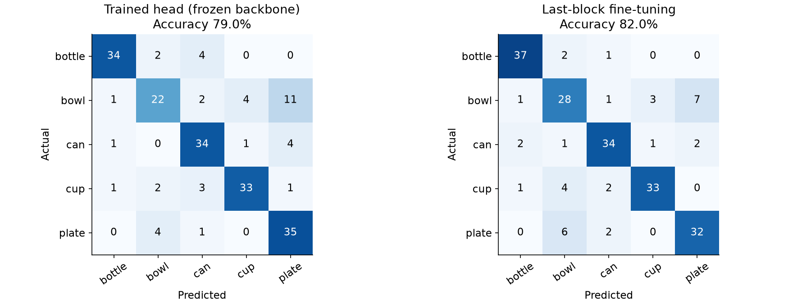

# JAX·TPU 심화 · 직접 호출 버전의 실제 검증 기록

이 문서는 JAX·TPU 선택 심화 과정입니다. [기본 HF·PyTorch GPU 실습](../hf_colab_gpu/README.md)을 먼저 진행하세요. 심화 환경은 `bash scripts/setup.sh --with-jax`로 준비합니다.

검증일: 2026-09-19. 자체 Python 패키지를 설치하지 않고, 학생 노트북에 보이는 코드 셀을 실행한 결과입니다. 이전 버전의 GPU·TPU 실행 결과와 구분합니다.

## 무엇을 실행했나요?

NumPy, Pillow, Safetensors, JAX, Optax, Matplotlib, PyArrow를 직접 불러옵니다. 데이터 준비, 모델 연산, 손실 함수, 두 학습 반복문, 평가와 저장 코드가 노트북 안에 있습니다.

프로젝트 패키지가 설치되지 않았고 `vision_lab`를 import할 수 없는 상태임을 확인했습니다. 별도의 새 Python 3.12 가상환경에서도 requirements의 공개 라이브러리만 설치해 import와 JAX CPU 검사를 통과했습니다. [환경 근거](../validation/direct/environment.json)

## 노트북 실행

| 노트북 | 수행한 검사 | 결과 |
|---|---|---|
| 00 · 환경과 데이터 | 실제 데이터 읽기·분할·저장, 샘플 그림 | 통과 |
| 01 · 사전학습 추론 | 실제 가중치, 이미지 전처리, CPU 추론, Top-5 그림 | 통과 |
| 02 · GPU 학습 코드 | CPU를 명시해 전체 500/100/200장, 각 3 epoch 실행 | 통과; GPU 검증과 별도 |
| 03 · TPU 학습 코드 | CPU 축소 모드를 명시해 셀 실행 흐름 검사 | 통과; TPU 검증과 별도 |
| 04 · 직접 촬영한 사진 | 기본 안내와 입력 유무 확인 분기 | 통과; 사용자 사진은 제공되지 않음 |

실행한 노트북은 [validation/direct](../validation/direct)에 출력과 함께 보관했습니다. [노트북별 검사 기록](../validation/direct/notebook-checks.json)

## 같은 조건의 전체 학습 결과

- 모델: `facebook/deit-tiny-patch16-224`, revision `b3428f18dcc7b543470d07f14b4a4157815d1880`
- 물체: 병·그릇·캔·컵·접시. CIFAR-100에서 학습 500장, 검증 100장, 테스트 200장
- 분류기 학습 3 epoch, 학습률 0.001 → 마지막 블록 파인튜닝 3 epoch, 학습률 0.0001
- JAX 0.11.1, FP32, Adam, batch size 16, seed 42
- 검증 손실로 각 단계의 체크포인트를 선택하고 테스트 정답은 최종 평가에만 사용

| 실행 장치 | 분류기만 학습한 정확도 | 부분 파인튜닝 후 정확도 | 파인튜닝 후 macro-F1 |
|---|---:|---:|---:|
| 로컬 CPU · 전체 데이터 | 79.0% | 82.0% | 0.8204 |
| Colab Tesla T4 GPU | 79.0% | 82.0% | 0.8204 |
| Colab TPU v5 lite · 요청 기종 v5e1 | 79.0% | 82.0% | 0.8204 |

GPU와 TPU는 새 노트북을 공식 Colab CLI로 각각 실행했습니다. 두 실행 모두 셀 오류가 없고 결과 파일의 SHA-256이 보고서와 일치하며, 앞부분 가중치 불변과 마지막 블록 변경을 확인했습니다. TPU 노트북에서는 업로드한 GPU 보고서와 모델·데이터·설정이 같은지 검사한 뒤 비교 그림을 출력했습니다. 결과 회수 후 각 세션 종료와 서버의 활성 세션 없음까지 확인했습니다.

- [이번 GPU 전체 보고서](../validation/direct/gpu/report.json)
- [GPU 코드 실행·파일 검증](../validation/direct/gpu/verification.json)
- [GPU 세션 종료 기록](../validation/direct/gpu/cleanup.json)
- [이번 TPU 전체 보고서](../validation/direct/tpu/report.json)
- [TPU 코드 실행·파일 검증](../validation/direct/tpu/verification.json)
- [TPU 세션 종료 기록](../validation/direct/tpu/cleanup.json)

원본 1,000개 ImageNet 라벨 추론은 관찰용입니다. 표의 비교 기준은 새 5개 클래스 분류기를 학습한 모델입니다. 200장 중 정답이 158장에서 164장으로 늘었으며 개선 폭은 3%p입니다. 이번 작은 공개 데이터 분할에서 얻은 값으로, 실제 작업대 카메라의 성능을 뜻하지 않습니다.

CPU·GPU·TPU 전체 실행에서 앞의 11개 블록 등 동결 부분은 그대로이고 마지막 사전학습 블록은 변경됐습니다. 학습 대상은 마지막 블록·최종 정규화·분류기의 총 446,213개 파라미터입니다. [CPU 전체 보고서](../validation/direct/cpu-full/report.json)

## 검증 범위와 재실행

환경·패딩 배치의 손실/미분·배포 파일 검사를 포함한 자동 테스트 15개를 통과했습니다. 검증용 코드도 별도 프로젝트 패키지 설치 없이 실행하며, `python -m pytest -q` 또는 `pytest -q`를 사용할 수 있습니다.

배포 ZIP을 다른 임시 폴더에 풀고, 별도로 만든 공개 라이브러리 전용 가상환경에서 01번 추론 셀을 처음부터 끝까지 실행했습니다. 기존에 검증한 준비 데이터를 입력으로 복사했으며 프로젝트 경로와 자체 패키지에 의존하지 않는 것을 확인했습니다. 이 검사는 네트워크 다운로드나 Codespaces 컨테이너 빌드 검사를 대신하지 않습니다. [검사 요약](../validation/direct/test-summary.json)

04번은 실제 사용자 사진 대신 공개 이미지에서 별도로 고른 두 클래스의 소규모 입력으로 사진 읽기·분할 저장·중복 검사·덮어쓰기 거부를 확인했습니다. 이 두 클래스 데이터로 02번의 학습 반복문을 실행하고, 04번에서 체크포인트를 복원해 추론하는 과정도 통과했습니다. 기본 5개 클래스 체크포인트의 복원 예측은 저장된 예측 CSV와 일치했습니다. 갤러리·Top-5·혼동행렬·학습 곡선·복원 추론 그림도 직접 확인했습니다. [추가 검사 기록](../validation/direct/student-review.json)

실제 GitHub Codespace를 새로 생성해 최초 컨테이너 빌드부터 확인한 것은 아닙니다. 이 호스트에서는 Docker를 실행할 수 없어 새 가상환경 설치와 노트북 실행을 확인했습니다. 학생 계정의 첫 OAuth2 로그인과 GPU·TPU 가용량도 별도로 확인해야 합니다.

노트북 00·01·04는 Codespaces CPU에서 실행하고, 02·03은 [공식 Colab CLI 단계별 안내](direct-colab-cli.md)에 따라 각각 GPU·TPU에서 실행합니다. 출력 노트북의 오류 유무, 실제 장치, 보고서의 완료 상태, 가중치 변경, 결과 회수, 세션 종료까지 확인합니다.

GPU·TPU 노트북의 기본값은 해당 가속기입니다. 가속기를 찾지 못하면 중단하며 CPU 결과로 완료를 대신하지 않습니다. 강사용 CPU 검증은 `VISION_DEVICE=cpu`를 명시했을 때만 진행됩니다.
