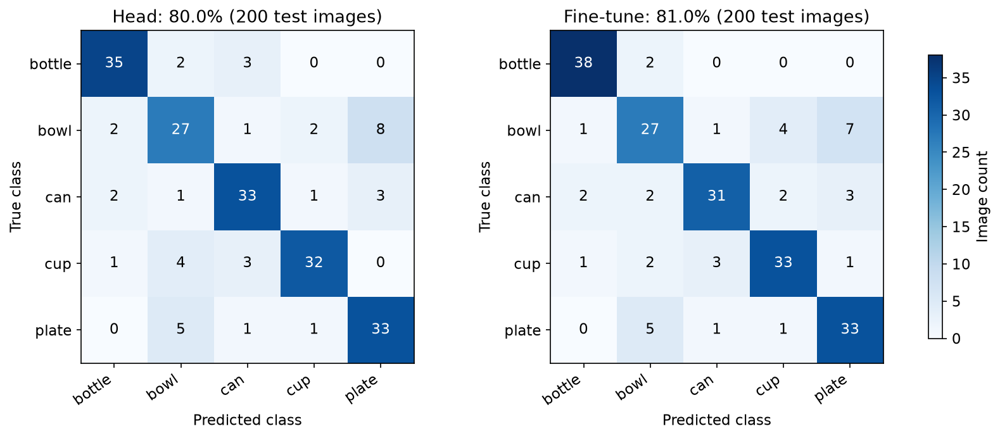
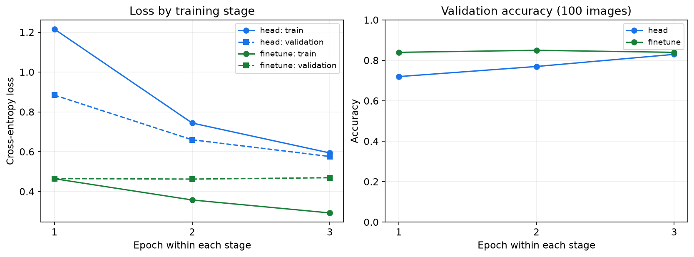

# HF CLI·Transformers·PyTorch 기본 과정 검증

검증일: 2026-09-19. 아래는 **빈칸 실습으로 바꾸기 전 완성된 코드**의 실행 기록입니다. 현재 학생이 네 개의 실습 셀을 채운 코드나 이번 저장소 정리 후 새 GPU 실행을 검증한 기록은 아닙니다. AI 코딩 실습으로 바꾼 뒤의 검사 범위는 [AI 코딩 실습 안내](ai-coding-workshop.md#이번-변경의-확인-범위)에 따로 정리했습니다.

## 모델 다운로드와 기본 환경

00번 노트북을 실제로 실행해 `hf download`로 원본 모델의 `config.json`, `preprocessor_config.json`, `pytorch_model.bin`을 받았습니다. 고정 revision은 `b3428f18dcc7b543470d07f14b4a4157815d1880`이며 세 파일의 SHA-256을 검증했습니다. 데이터 분할은 학습 500장·검증 100장·테스트 200장입니다.

- [실제 CLI 준비 검사](validation/preparation.json)
- [독립 환경 검사](validation/environment.json)

새 Python 3.12 가상환경에 기본 `requirements/codespaces.txt`만 설치했습니다. PyTorch·Transformers·Safetensors 등 GPU 학습 라이브러리가 설치되지 않은 상태에서 HF/Colab CLI와 준비 노트북의 import가 정상 동작했습니다. 기본 과정의 학습 라이브러리는 Colab에 설치합니다.

## GPU 실행 검증

실제 Colab **Tesla T4**에서 당시 완성된 01번·02번 노트북의 코드 셀을 그대로 실행했습니다. 추론 7개 코드 셀과 학습 15개 코드 셀에 오류가 없었습니다. PyTorch `2.8.0+cu126`, Transformers `4.57.6`, Hugging Face Hub `0.36.0`을 사용했습니다.

| 모델 | 선택한 epoch | 검증 정확도 | 테스트 정확도 · 200장 | 테스트 Macro F1 |
|---|---:|---:|---:|---:|
| 사전학습 백본 고정 + 새 분류기 | 3 | 83.0% | **80.0% · 160장 정답** | 0.8002 |
| 마지막 블록·최종 정규화·분류기 파인튜닝 | 2 | 85.0% | **81.0% · 162장 정답** | 0.8091 |

각 단계는 3 epoch까지 학습했습니다. 검증 정확도를 먼저 보고, 동률이면 검증 손실로 저장할 모델을 골랐습니다. 테스트 정답으로 epoch를 선택하지 않았습니다. batch size 16, seed 42, Adam, 학습률은 분류기 0.001·파인튜닝 0.0001입니다.

이번 테스트에서는 정답이 2장 늘어 **1%p 개선**됐습니다. 병의 정답은 35장에서 38장으로 늘었지만 캔은 33장에서 31장으로 줄었습니다. 전체 정확도와 클래스별 변화가 같은 방향으로 움직이지 않을 수 있습니다.

검증 정확도가 파인튜닝 2 epoch에서 가장 높았고 3 epoch에서는 조금 내려갔습니다. 학습 손실이 계속 줄더라도 마지막 epoch가 항상 가장 좋은 모델은 아닙니다.

01번 원본 모델 추론도 실제로 수행했습니다. 예시 컵 이미지의 원래 1,000개 라벨 Top-5는 물체 라벨과 잘 맞지 않았습니다. 이는 출력 형식과 데이터 환경을 먼저 확인하는 관찰 사례이며, 위 표의 5개 클래스 기준 정확도로 환산하지 않습니다.

| 검사 | 결과 |
|---|---|
| GPU 사용과 원본 HF 파일 확인 | Tesla T4, 고정 revision·SHA-256 일치 |
| 학습할 가중치 수 | 마지막 블록·최종 정규화·분류기 446,213개 |
| 고정한 앞부분 유지 | 학습 전후 SHA-256 동일 |
| 마지막 사전학습 블록 변경 | 학습 전후 SHA-256 다름 |
| Safetensors 저장·재로딩 | 같은 이미지 출력의 최대 절대 차이 0.0 |
| 결과 파일 회수 | 학습 보고서에 기록한 모든 파일의 SHA-256 일치 |
| 세션 종료 | 종료 후 서버 활성 세션 없음 확인 |

근거: [추론 보고서](validation/gpu/inference_report.json), [학습 보고서](validation/gpu/report.json), [노트북·파일 검증](validation/gpu/verification.json), [세션 종료](validation/gpu/cleanup.json).

추가 근거: [원본 모델 Top-5 그림](validation/gpu/pretrained_top5.png), [epoch별 학습 기록](validation/gpu/training.csv), [테스트 이미지별 예측](validation/gpu/predictions.csv). 저장소에는 실습 파일과 혼동하지 않도록 실행본 노트북 사본을 두지 않습니다. 위 JSON·CSV·그림은 당시 결과를 보존한 참고 자료입니다.

## 발견해서 고친 문제

1. Colab CLI 0.6.0의 `install` 내부 대기시간이 짧아 큰 PyTorch 설치가 약 60초 뒤 중단됐습니다. 실패한 세션은 종료하고 활성 세션이 없는 것을 확인했습니다. 안내를 requirements 파일 전송 후 `colab exec --timeout 1800`에서 설치하는 방식으로 변경했습니다.
2. CLI가 노트북 셀 오류 후 다음 셀을 실행할 수 있어, 단순 예외만으로는 기존 결과를 보호할 수 없었습니다. 초기화된 실행 허용 상태를 모든 후속 학습·저장 셀이 확인하도록 수정했습니다. 오류 후 셀을 계속 실행해도 기존 보고서·CSV·그림·모델 파일이 바뀌지 않는 회귀 검사를 추가했습니다.

## 검증 범위

2026-09-19 당시 기본 라이브러리만 설치한 새 환경에서 자동 테스트 17개가 통과했고, 선택 모듈 1개는 건너뛰었습니다. 이 개수는 과거 검사 구성의 기록이며 현재 저장소의 테스트 개수를 뜻하지 않습니다. 이번 실습의 모델 계산에는 공개 Transformers·PyTorch 라이브러리를 사용합니다.

2026-09-19에 실제 GitHub Codespace를 새로 생성해 자동 환경 설치와 00번 노트북 실행을 확인했습니다. 모델·데이터 캐시가 없는 첫 실행에서 코드 셀 17개가 모두 실행됐고 오류는 없었습니다. 다만 검증기의 출력 해석 오류로 첫 보고서 작성은 실패했습니다. 검증기만 수정한 뒤 기존 캐시가 있는 상태에서 환경 검사·노트북·자동 테스트 전체가 통과했습니다(당시 구성의 테스트 17개 통과, 선택 모듈 1개 건너뜀). 브라우저의 커널 선택과 Run All도 별도로 확인했습니다. 자세한 조건과 한계는 [Codespaces 검증 기록](codespaces-verification.md)에 정리했습니다.

이번 Codespaces 검사에서는 Google 첫 OAuth2 로그인이나 Colab GPU 실행을 다시 수행하지 않았습니다. 위 T4 실측은 로컬 환경에서 CLI와 기존 ADC 인증을 사용한 별도 검증입니다. 학생 계정의 첫 OAuth2 로그인·CU·T4 가용량은 수업 전에 별도로 확인해야 합니다.

공개 CIFAR 이미지의 결과는 실제 작업대 사진 성능을 의미하지 않습니다. 학생이 작성한 함수나 학습 설정에 따라 결과가 달라질 수 있으므로 본인의 출력과 오류 여부를 따로 확인합니다.
